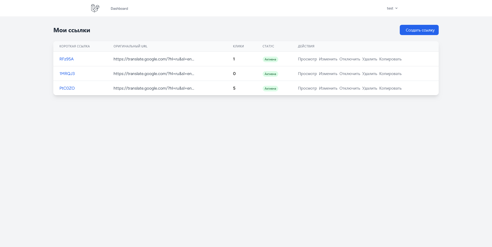
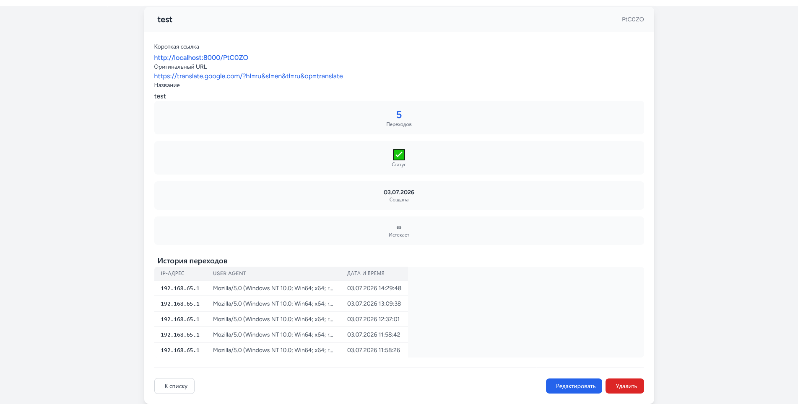

# 🔗 URL Shortener Service

Сервис для создания коротких ссылок с отслеживанием статистики переходов, построенный на Laravel 13 с использованием чистой архитектуры (Service Layer + Repository Pattern).

##  Возможности

### Пользовательские функции
- ✅ **Регистрация и аутентификация** (Laravel Breeze)
- ✅ **Создание коротких ссылок** с кастомным названием
- ✅ **Автоматическая генерация** уникального короткого кода
- ✅ **Редирект** по короткой ссылке на оригинальный URL
- ✅ **Управление ссылками** (просмотр, редактирование, удаление)
- ✅ **Активация/деактивация** ссылок
- ✅ **Срок действия** ссылок (опционально)

### Статистика
- ✅ **Отслеживание переходов** (IP, User-Agent, Referer)
- ✅ **Счетчик кликов** для каждой ссылки
- ✅ **Список переходов** в личном кабинете

### Архитектурные особенности
- ✅ **Service Layer** — бизнес-логика изолирована
- ✅ **Repository Pattern** — абстракция доступа к данным
- ✅ **SOLID принципы** — чистая и поддерживаемая архитектура
- ✅ **Строгая типизация** — PHP 8.1+
- ✅ **Dependency Injection** — все зависимости внедряются

---

## 🛠 Технологии

| Компонент | Технология              |
|-----------|-------------------------|
| **Backend** | Laravel 13.x            |
| **PHP** | PHP 8.2+                |
| **База данных** | MySQL 8.0               |
| **Frontend** | Blade + Tailwind CSS    |
| **Контейнеризация** | Docker + Docker Compose |
| **Аутентификация** | Laravel Breeze          |
| **Миграции** | Laravel Migrations      |
| **Тестирование** | PHPUnit                 |

---

## 📐 Архитектура

Проект построен на принципах **чистой архитектуры** с четким разделением ответственности.

### Ключевые паттерны

#### Service Layer
Вся бизнес-логика вынесена в сервисы (`app/Services/`). Контроллеры вызывают сервисы, а не работают напрямую с моделями.

#### Repository Pattern

Доступ к данным абстрагирован через репозитории. Легко сменить источник данных (MySQL → MongoDB → API).

## Скриншоты

Список ссылок:

Просмотр ссылки и статистика:

## Быстрая установка
Проект оптимизирован для запуска через Docker. 

Все необходимые файлы уже включены:

    ✅ Все исходные файлы Laravel (src/)

    ✅ Данные базы MySQL (db/) — готовые таблицы и тестовые данные

    ✅ Настроенный .env для Docker

    ✅ Конфигурация Nginx

    ✅ Dockerfile для PHP, Composer, Node.js

    ✅ Все зависимости (composer, npm) установлены

git clone (репозиторий)

docker-compose up

установка зависимостей:

docker-compose run composer install

docker-compose run node run build

## Тесты
запуск:

./art test tests/Feature/LinkTest.php

## Прочее:

art.bat - файл для упрощения обращений к контейнеру artisan.

пример: ./art migrate

